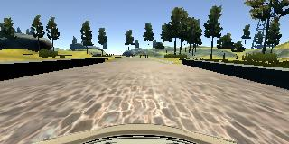
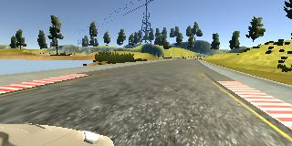

The goals / steps of this project are the following:
- Use the simulator to collect data of good driving behavior
- Build, a convolution neural network in Keras that predicts steering angles from images
- Train and validate the model with a training and validation set
- Test that the model successfully drives around track one without leaving the road
- Summarize the results with a written report


[//]: # (blog or webpages references)

[link1]: https://arxiv.org/pdf/1604.07316.pdf "End to End Learning for Self-Driving Cars"
[link2]: https://chatbotslife.com/using-augmentation-to-mimic-human-driving-496b569760a9#.lhnmfw94z "An augmentation based deep neural network approach to learn human driving behavior"
[link3]: https://medium.com/@ksakmann/behavioral-cloning-make-a-car-drive-like-yourself-dc6021152713#.tg2ah5ebl "Behavioral Cloning — make a car drive like yourself"

## Rubric Points

---
###Files Submitted & Code Quality

####1. Submission includes all required files and can be used to run the simulator in autonomous mode

My project includes the following files:
* model.py containing the script to create and train the model
* drive.py for driving the car in autonomous mode
* model.h5 containing a trained convolutional neural network
* writeup_report.pdf (this document) summarizing the results
* video.mp4 video of how the model drives around track one.
* video_track2.mp4 video of how the model drives around track two.

####2. Submssion includes functional code
Using the Udacity provided simulator and my drive.py file, the car can be driven autonomously around the track by executing
```sh
python drive.py model.h5
```

####3. Submssion code is usable and readable

The model.py file contains the code for training and saving the convolutional neural network. The file shows the pipeline I used for training and validating the model, and it contains comments to explain how the code works.

###Model Architecture and Training Strategy

####1. An appropriate model arcthiecture has been employed
I started with the network described in NVIDIA's End to End Learning for Self-Driving Cars paper ([link1]) and tried to fine tune it.

It consists of a convolutional neural network with 3 layers of convolution of 5x5 and 2 layers 3x3 filters and depths between 24 and 64 (model.py lines 39-52). Convolution layers were widened during the fine-tuning process.

Convolutional layers are followed by fully connected layers with sizes between 1164 an 10, with an output layer of size 1, which outputs the predicted steering angle.

The model includes RELU layers to introduce nonlinearity, and the data is normalized in the model using a Keras lambda layer (code line 37).

Since this is a regression task, the model is trained using the Mean Squared Error metric.

I tried to add Max-Pooling layers after each convolutional layer to reduce the number of parameters as well adding Dropout layers after fully connected layers to prevent overfitting, but I removed the Max-Pooling and reduced the Dropout rate after checking that while the car was able to drive around both tracks, the performance was subjectively worse, perceived as a more wobbly driving.
I also tried to reduce the 1164 neuron fully connected layer to reduce the number of parameters, but this caused the model to perform badly and not being able to complete a lap around the track.
These attempts to reduce the complexity of the model resulted in a slightly bigger validation loss, but the difference was evident when checking the performance when I let the model drive the car on both tracks.

####2. Attempts to reduce overfitting in the model

After checking that Dropout layers did not made the model perform well enough, my strategy to avoid overfitting was to increase the number of data samples. Since I noticed that the collected driving data was not good enough (specially driving with a keyboard) and due to to the difficulty of collecting enough recovery events, I switched my strategy to use data augmentation, generating new training data from a smaller data set. This was inspired by the NVIDIA paper, which uses tree cameras, coupled with shifts and rotations, and the articles of fellow students Vivek Yadav ([link2]) and Kaspar Sakmann ([link3])


The model was trained and validated on different data sets to ensure that the model was not overfitting (code line 104) The model was tested by running it through the simulator and ensuring that the vehicle could stay on the track, remain centered and driving as straight as possible.

####3. Model parameter tuning

The model used an Adam optimizer, so the learning rate was not tuned manually (model.py line 95)

####4. Appropriate training data

Training data was chosen to keep the vehicle driving on the road. I used a combination of center lane driving, recovering from the left and right sides of the road and data augmentation.

For details about how I created the training data, see the next section.

###Model Architecture and Training Strategy

####1. Solution Design Approach

The overall strategy for deriving a model architecture was to use a convolution neural network model equal or similar to the NVIDIA end-to-end self driving paper. I thought this model might be appropriate because it is a proven model in the task of predicting steering angles.

After investigating how the distribution of steering angles looks like, I realized that training the model with this data would bias (overfit) towards straight driving and that it would not generalize to other scenarios when driving. The data is also skewed towards negative angles. This is due to driving the car around the track in one direction, with mostly left turns.

In order to gauge how well the model was working, I split my image and steering angle data into a training and validation set, using 20% of the data for the validation set. I also used the non-automatic metric of checking the performance of the model by letting it drive the car around the first and second tracks.

To combat the overfitting, I followed two strategies, I modified the model with dropout layers with small drop rates (as larger drop rates did not perform well) and added data augmentation, randomly using left, center and right camera images, to try to remove the straight driving bias, and image flipping to remove that bias towards left turning.

The final step was to run the simulator to see how well the car was driving around track one. There were a few spots where the vehicle fell off the track. To improve the driving behavior in these cases, I realized that I had to add recovery scenarios. Still, it was difficult to record enough recovery scenarios with good driving behavior and the data was still biased towards straight driving with some large steering angles that the training process would treat as outliers. Since the car would still fail to recover from some situations and complete the track. I decided to use more augmentation techniques. After evaluating using simple horizontal image shifts as presented by the NVIDIA paper and Vivek Yadav's article, I decided to use Kaspar Sakmann's technique of random horizontal shearing to make the road appear more curvy.

After that, I tried to fine tune the model reducing the size of the input image to the CNN and adding Max-Pooling layers to reduce the number of parameters. I decided to keep the image as small as possible and dropped the Max-Pooling layers since the car would drive more smoothly.

At the end of the process, the vehicle is able to drive autonomously around the track without leaving the road.

####2. Final Model Architecture

The final model architecture (model.py lines 36-69) consisted of a convolution neural network with the following layers and layer sizes:


Input: 64 x 64 x 3  
Lambda (Normalization layer, from -1 to 1): Output 64 x 64 x 3  
Convolutional: 24 filters of size 5 x 5, stride 2 x 2  
Convolutional: 36 filters of size 5 x 5, stride 2 x 2  
Convolutional: 48 filters of size 5 x 5, stride 2 x 2  
Convolutional: 64 filters of size 3 x 3, stride 1 x 1  
Convolutional: 64 filters of size 3 x 3, stride 1 x 1  
Dense: 1164 neurons  
Dense: 100 neurons  
Dense: 50 neurons  
Dense: 10 neurons  
Output: 1  

After each Fully connected layer I added Dropout layers with a drop probability of 0.2.

Here is a visualization of the architecture


####3. Creation of the Training Set & Training Process

To capture good driving behavior, I first recorded a few laps on track one using center lane driving. Here is an example image of center lane driving:



I then recorded the vehicle recovering from the left side and right sides of the road back to center so that the vehicle would learn to recover from the sides of the road These images show what a recovery looks like starting from the right:


I did no collect data from track two as I wanted to keep it as a validation metric and how well it performs on unseen data.

After the collection process, I had around 10,000 number of data points. I randomly shuffled the data set and put 20% of the data into a validation set.

The final training images are generated through a generator that creates training batches by randomly selecting data points from the entire input dataset, and applying transformations to the selected sample:


For the selected data point, the camera (left,right,center) is randomly chosen and the steering angle is corrected. The steering angle changes were adjusted manually by trial and error, using this article ([link2]). A more rigorous approach would use vehicle geometry to determine these angles.

Left| Center | Right
----|--------|-------
 |  | 

Then I applied a random shear. With this augmentation technique the image is sheared horizontally to simulate a bending road. This is done through an affine transformation, keeping the bottom of the image fixed while the top is moved randomly to the left or the right. The applied steering angle correction for this transformation was proportional to shearing angle. Shearing was applied randomly, leaving around 10% of the images not transformed.

Original | Sheared
---------|---------
 | 

After shearing the image was cropped as it contains unnecessary data above the horizon at the top of the image and below the hood at the bottom. Care has been taken not to remove too much of the image from the top as it could remove useful data when driving up or down a slope.

Original | Cropped
---------|---------
 | 

I also randomly flipped images and the corresponding angles as this would remove the left steering bias. Flipping was applied with a probability of 50%. For example, here is an image that has then been flipped:


Original | Flipped
---------|---------
 | 

In order to let the model generalize better in different lighting conditions (as in track two), I applied random brightness modifications. This was done through gamma correction as I found that it performed slightly better than straight brightness adjustment to the H channel in the HSV color-space.

Original | Random brightness
---------|-------------------
 | 

I resized the image it to its final size 64x64. This preprocessed image is fed to the model, and the training process uses the MSE as the metric to minimize.


The validation set was not augmented. For validation purposes, I used the center camera image and I only applied the preprocessing steps of cropping and resizing.

I used this augmented data generated in batches for training the model. I used an Adam optimizer so that manually training the learning rate wasn't necessary. The validation set helped determine if the model was over or under fitting.
I used 20000 training samples per epoch, with 200 samples per batch. I found that the ideal number of epochs was 7 as evidenced by the fact that training loss settle (decreases very slowly) and the validation loss does not increase (nor decreases). The validation loss settles before the training loss and it remains stable. I also found that the model was able to drive smoothly in both tracks with this number of epochs.
